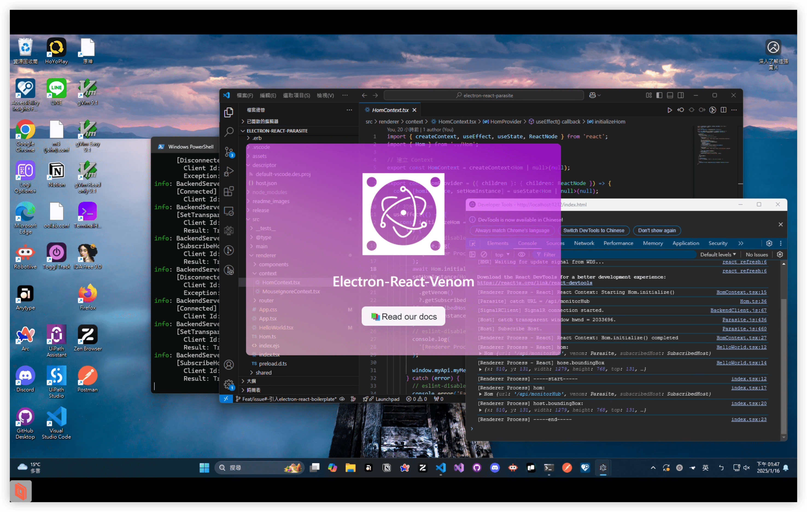

# Electron-React-Venom Template
使用 React 作為前端畫面框架的 Electron-Venom Template  
主要以 [electron-react-boilerplate](https://github.com/electron-react-boilerplate/electron-react-boilerplate/tree/main?tab=readme-ov-file) 為基底進行調整。

## Dependencies
- Node.js <= v16.20.2
- [Host Object Model (package)](http://gitlab.oolab.csie.ncu.edu.tw/ar-project/package/host-object-model) <= 2.0.0
- [BackendServer](http://gitlab.oolab.csie.ncu.edu.tw/ar-project/data-collection-methods/backend-server) <= v2.1.0

## Getting Start
詳細可以查看[文件](https://hackmd.io/@oolabsoftwarear/r1gUBUrvJe)


### Setup

1. 取得 Template
透過 CLI 工具取得 Template  
參考 [create-venom-app 使用方式](http://gitlab.oolab.csie.ncu.edu.tw/ar-project/template/venom-template-cli-tool)

2. 安裝依賴
```shell
npm ci
```

3. 執行 BackendServer
- 到[這裡](http://gitlab.oolab.csie.ncu.edu.tw/ar-project/data-collection-methods/backend-server/-/packages)下載 BackendServer
- 點擊 `BackendServer.exe` 執行

4. 開啟 Host 應用程式
- 如果你是直接用預設的話，請開啟一個 VSCode (只能有一個視窗)

5. 執行專案
```shell
npm start
```

4. 接著你應該會看到如下畫面  
代表你成功了，這個畫面除了 Read our docs 這個按鈕外，滑鼠都是碰不到的  
你可以點擊 Read our docs 查看更詳細文件說明以進行開發


### VSCode Extension
在 `.vscode/extension.json` 中有列兩個 extension，可以安裝  
裡面列的是 extension 的 Installation Identifier，可以用此去尋找對應的 extension  
或是 VSCode 也會跳出建議安裝的 extension，直接安裝也可

## Package
1. Format Style
```shell
# 讓 code 符合 style
npm run lint:fix
```

2. 進行打包
```shell
npm run package
```
你會在 `release/build/` 底下看到打包完的結果

## License
...(待補)
